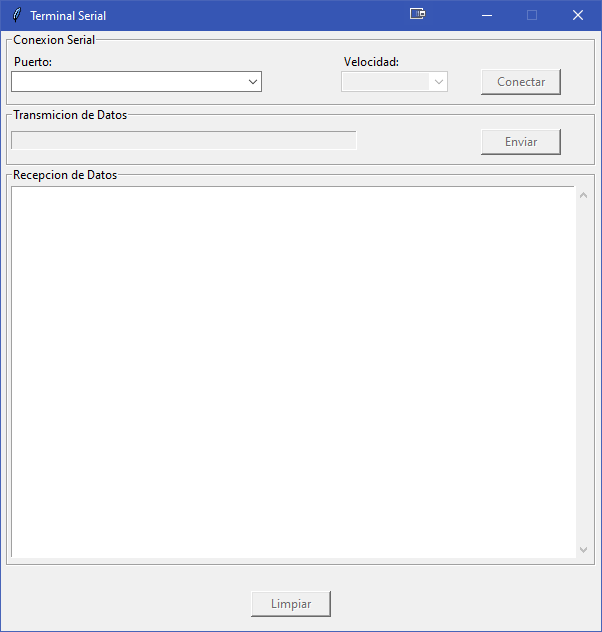

# myTerminal: Interfase serial basica para comunicacion con otros dispositivos

**myTerminal** es un aplicativo basico de comunicacion serial que permite adaptarlo a otros proyectos.

## Características

- Interfaz tkinter.
- Envio y recepcion de comandos seriales.
- Facil de entender y modificar.

## Requisitos

- Python 3.x
- tkinter
- Pyserial

## Instalación

1. Clona este repositorio:
   ```bash
   git clone https://github.com/CAFlores1969/SerialTermminal

2. Instala las dependencias:
   ```bash
   pip install tkinter Pyserial

4. Uso
   ```bash
   python myTerminal.py

Esto abrirá la interfaz gráfica para interactuar con el terminal serial.

